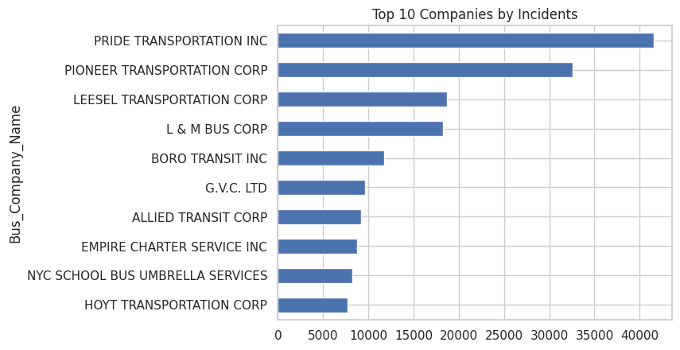
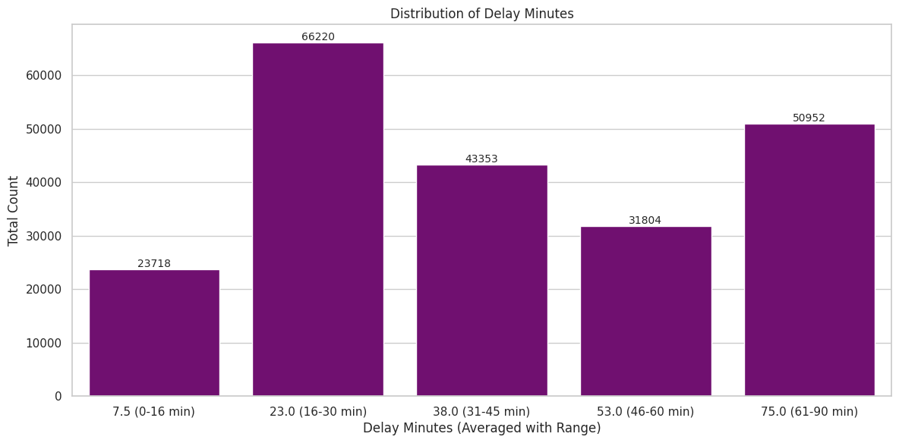
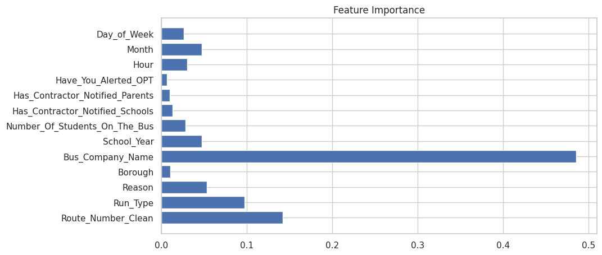
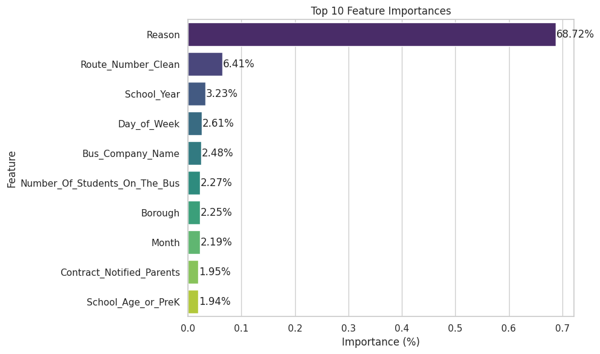

# 🚍 Predicting NYC School Bus Breakdowns & Delays

*By Team B — Nasim Aalemi, Shobha Panthi, James Gilmore*  
[📂 GitHub Repository](https://github.com/naalemi/Predicting_NYC_School_Bus_Breakdowns_Capstone_Project-Team-B-)  
[📊 Dataset – NYC Open Data](https://data.cityofnewyork.us/Transportation/Bus-Breakdown-and-Delays/ez4e-fazm/about_data)  

---

## 📌 Overview

Every school day, thousands of NYC students depend on yellow school buses to arrive safely and on time. But breakdowns and delays happen — sometimes frequently — disrupting schedules and impacting learning.

In this project, we analyzed **228,000+ incident records (2022–2025)** from NYC Open Data to:
- Identify patterns behind delays and breakdowns.
- Predict **delay length** and **incident type** using machine learning.
- Build interactive tools to support better decision-making for the NYC Department of Education.

We built:
- **Random Forest Regressor** to predict delay minutes.
- **XGBoost Classifier** to predict if an incident is a *breakdown* or *running late*.
- A **Streamlit web app** for quick predictions.
- A **Power BI dashboard** for deeper exploration.

---

## 🛠 Data Preparation

The raw dataset was messy and inconsistent. We cleaned and standardized:
- **Bus company names** → unified variants like `"RELIANT TRANS, INC."` and `"RELIANT TRANSPORTATION, INC."`.
- **Route numbers** → removed invalid entries and standardized format.
- **Delay times** → converted hours/minutes/ranges to a single numeric `Delay_Minutes` field.
- **Student counts** → capped unrealistic values at 72.
- Removed non-NYC records to focus on **Manhattan, Brooklyn, Queens, Bronx, Staten Island**.

---

## 🔍 Exploratory Data Analysis

**Top Companies by Incident Count**  
  
Some companies, such as Pride and Pioneer, show disproportionately high incidents — possibly due to operating more routes or maintenance issues.

**Distribution of Delay Minutes**  
  
Most delays last **16–30 minutes**, with a surprising number of long delays (61–90 minutes).

**Key Observations:**
- **Queens** has the highest average delay (49.6 min).
- **Heavy Traffic** is the #1 cause, followed by mechanical problems.
- Incidents peak in **morning (5–7 AM)** and **afternoon (1–3 PM)**.

---

## 🤖 Modeling

### **1. Predicting Delay Time (Regression)**
- **Model:** Random Forest Regressor
- **Target:** `Delay_Minutes`
- **Performance:**
  - RMSE: ~9.65 minutes
  - R²: ~82%
- **Top Features:**
  

---

### **2. Predicting Breakdown vs Delay (Classification)**
- **Model:** XGBoost Classifier with SMOTE oversampling.
- **Target Classes:**  
  `0` = Running Late, `1` = Breakdown
- **Performance:**
  - Overall F1-score: **97%**
  - Running Late: Precision & Recall ≈ 99%
  - Breakdown: Precision ≈ 73%, Recall ≈ 82%
- **Top Features:**
  

---

## 🌐 Interactive Tools

- **Streamlit App**  
  Uploads a trained model, target encoder, and scaler to let users input route, borough, reason, and more — returning instant predictions with confidence.
- **Power BI Dashboard**  
  Provides borough-level insights, delay cause breakdowns, and company performance analysis.

---

## 📈 Next Steps
- Add weather data and driver info for richer predictions.
- Test additional models (Neural Networks, Gradient Boosted Trees).
- Build "what-if" simulations — e.g., removing worst-performing companies.

---

## 💡 Impact

This work transforms raw transportation logs into **actionable intelligence** for school transportation planners.  
Better insights → better planning → safer, more reliable rides for NYC students.

---

**Team B – Predicting School Bus Breakdowns and Delays in NYC**
